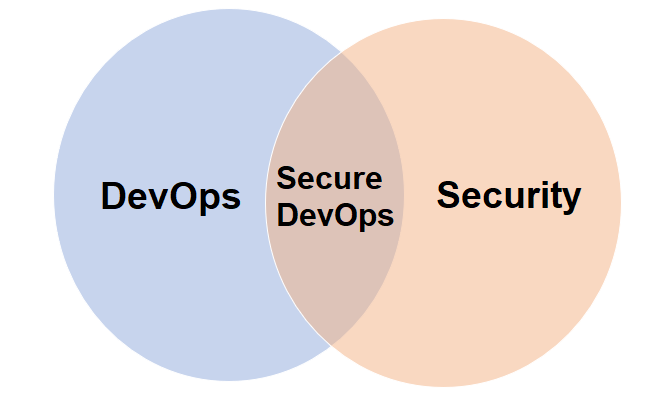
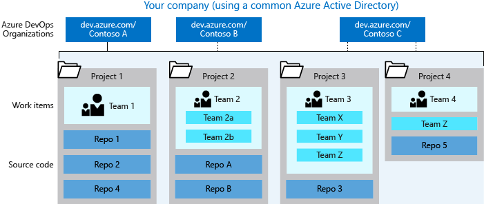

# Configure a project and repository structure to support secure pipelines

## Introduction

- While a DevOps culture enables development and operations teams to deploy applications faster, going faster over a cliff doesn't help.

- Cloud environments brought unprecedented infrastructure and scale to DevOps teams. They can be approached by some of the most nefarious actors on the internet, as they risk the security of their business with every application deployment.

- DevOps is about working faster. Security is about-emphasizing thoroughness. Security concerns are typically addressed at the end of the cycle. It can potentially create unplanned work right at the end of the pipeline. Secure DevOps integrates DevOps with security into a set of practices designed to meet the goals of both DevOps and safety effectively.

- A Secure DevOps pipeline allows development teams to work fast without breaking their project by introducing unwanted security vulnerabilities.

# Organize Project and Repository Structure

## Best Practices for Organizing projects and Repositories

- Overall, it's advisable to use your business structure as a guide for the number of organizations, projects, and teams that you create in Azure DevOps. Have at least one organization, which may represent your company, your larger collection of code projects, or even multiple related business units.

- An organization in Azure DevOps is a mechanism for organizing and connecting groups of related projects. Examples include business divisions, regional divisions, or other enterprise structures. You can choose one organization for your entire company or separate organizations for specific business units.

- A single code repository or project only needs one organization. If you have separate teams that need to work on code or other projects in isolation, consider creating separate organizations for those teams.

- Within an organization, you can take one of these approaches:

    - Create a single project that contains many repos and teams
    - Create many projects, each with its own set of teams, repos, builds, work items, and other elements

## Single Project

- A single project puts all of the work at the same "portfolio" level for the entire organization. Your work has the same set of repos and iteration paths. With a single project, teams share source repos, build definitions, release definitions, reports, and package feeds. You might have a large product or service that's managed by many teams. Those teams have tight inter-dependencies across the product life cycle. You create a project and divide the work using teams and area paths. This setup gives your teams visibility into each other's work, so the organization stays aligned. Your teams use the same taxonomy for work item tracking, making it easier to communicate and stay consistent.

## Multiple Projects

- If you decide to create a project team for each distinct product or feature team, each team will have its own backlog. You can configure teams and backlogs into a hierarchical structure so you can more easily track progress across teams, manage portfolios, and generate rollup data. Having several projects shifts the administration burden and gives your teams more autonomy to manage the project as the team decides. It also provides greater control of security and access to assets across the different projects. However, having team independence with many projects creates some alignment challenges. If each project is using a different process or iteration schedule, it can make communication and collaboration difficult if the taxonomies aren't the same.

When you're considering many projects, keep in mind that Git repo portability makes it easy to migrate repos (including full history) between projects. Other history can't be migrated between projects. Examples are push and pull request history.

When you map projects to business units, your company gets a single organization and sets up many projects with one or more projects representing a business unit. All Azure DevOps assets of the company are contained within this organization and located within a given region.

## Organize and Secure Repositories

- You can organize your repositories in Azure Repos by using folders and adding specific groups and permissions to the repository. You can also use branch policies to secure your repositories. Branch policies allow you to:

    - Require a minimum number of reviewers
    - Require a minimum number of approvers
    - Require a minimum number of successful builds
    - Require linked work items

- Another way to organize your repositories is to use Git submodules. Git submodules allow you to keep a Git repository as a subdirectory of another Git repository. This lets you clone another repository into your project and keep your commits separate.

- In particular, a user with Create Branch permission at the repository level can introduce code to the repo even if that user lacks Contribute permission.

    - Keep sensitive files out with .gitignore: To help avoid the risk of someone inadvertently committing sensitive data, such as an API key or private configuration data is to build and maintain .gitignore files. These files instruct client tools, such as the git command line utility, to ignore paths and patterns when aggregating files for a commit.

    - Remove sensitive data from a repository: Project participants should always be on the lookout for commits containing data that shouldn't be included in the repository or its history.

    - Create branch protection rules: You can create branch protection rules to enforce certain workflows for one or more branches, such as requiring an approving review or passing status checks for all pull requests merged into the protected branch.

    - Add a CODEOWNERS file: By adding a CODEOWNERS file to your repository, you can assign individual team members or entire teams as code owners to paths in your repository. These code owners are then required for pull-request reviews on any changes to files in a path that they're configured for.

## Possible project and repository structures

- As previously discussed, the possibilities to structure your projects and repositories are endless depending on the idiosyncrasies of your business. You may want to map your organizations and projects in Azure DevOps to your enterprise, business unit, and team structure. And you may want to create one or more repositories under a single project for better version control and security.

- A sample of how your company could structure its organizations, projects, work items, teams, and repos.

## Shared Repos vs Forked Repos

- It's recommended to use a shared repo within a trusted organization. Developers use branches to maintain isolation of their changes from one another. With a good branching and release strategy, a single repo can scale to support concurrent development for more than a thousand developers.

- Forks can be useful when you're working with vendor teams that shouldn't have direct access to update the main repository. Forks can also be useful in scenarios where many developers contribute infrequently, such as in an open-source project.

- When you're working with forks, you may want to maintain a separate project to isolate the forked repos from the main repo. There may be added administrative overhead, but it keeps the main project cleaner.

## Create a Project and Repository structure

- Creating a clear project and repository structure is fundamental for improving security and you can do it by following an incremental approach. The security recommendations you choose to implement will depend a lot on the needs, practices, and policies of your organization.

- You can start by separating groups of resources by team projects, and defining what resources your pipeline can access based on project settings and containment. Every job in your pipeline receives an access token with permissions to read open resources. If you decide to shut off pipeline access to some of these resources, then your decision applies to all pipelines in a project as a specific pipeline can’t be granted access to an open resource. That’s why it's advised that you isolate project resources from one another.

- You would usually create one repository per project but, as previously discussed, it's also possible to create multiple repositories. Azure Repos provides two types of repositories: Git and TFVC. Projects can have repos of each type. What you need to know is that:

    - Git is a distributed version control system that allows multiple developers to work on the same codebase at the same time. It enables a great amount of flexibility in developer workflows and integrates with nearly every relevant tool in the developer ecosystem. By default, new projects have an empty Git repository and there’s no limit on the amount of Git repos that can be added to a project.

    - TFVC, on the other hand, is a centralized version control system that allows developers to manage their code changes in a centralized repository. Unlike Git, only one TFVC repository is allowed for a project. But, within that repo, folders, and branches are used to organize code for multiple products and services, if wanted.

- One project containing multiple repos works well if the products/services are working on a coordinated release schedule. If developers are frequently working with multiple repos, keep them in a single project to ensure the processes remain shared and consistent. It’s easier to manage repo access within a single project, as access control and options like case enforcement and max file size get set at the project level. You can manage the access controls and settings individually, even if your repos are in a single project. If the products stored in multiple repos work on independent schedules or processes, you can split them into multiple projects.

- Base your decision for one vs. many repositories on the following factors and tips:

    - Code dependencies and architecture.

    - Put each independently deployable product or service in its own repository.

    - Don’t separate a codebase into many repositories if you expect to make coordinated code changes across those repos, as no tools can help coordinate those changes.

    - If you have many disconnected services, one repo per service is a good strategy.

## Configure Secure Projects and Repositories

### Fundamental Concepts for Giving Permissions

- With the creation of an organization, collection, or project—Azure DevOps creates a set of default security groups, which are automatically assigned default permissions. Other security groups are defined with the following actions:

- When you create custom security groups at the following levels:

    - Project-level

    - Organization- or collection-level

    - Server-level (on-premises only)

- When you add a team, a team security group is created

## Project level Permissions

- Each team added to a project is automatically added as a project-level group. There are several permissions you can set up at the project level, and you can grant them by adding a user or group to the Project Administrators group, or you can grant select project-level permissions to a custom security group or to a user.

- To manage permissions or groups at the project level, you must be a member of the Project Administrators security group. If you created the project, you're automatically added as a member of this group. Users who wish to get added to this group would need to request permissions from a member of the Project Administrators group. Consider adding users to the Project Administrators group when they're tasked with adding or managing teams, area and iteration paths, repositories, service hooks, and service end points.

- There are five possible assignments made to a permission. They grant or restrict access as indicated:

- User or group has permissions to perform a task:

    - Allow

    - Inherited allow

- User or group doesn't have permission to perform a task:

    - Deny

    - Inherited deny

    - Not set

- Here's what you need to know about permission settings:

    - Allow or Deny explicitly grants or restricts users from performing specific tasks, and are inherited from group membership.

    - Not set implicitly denies users the ability to perform tasks that require that permission, but allows membership in a group that does have that permission set to take precedence, also known as Allow (inherited) or Inherited allow and Deny (inherited) or Inherited deny.

    - For most groups and almost all permissions, Deny overrides Allow. If a user belongs to two groups, and one of them has a specific permission set to Deny, that user isn't able to perform tasks that require that permission even if they belong to a group that has that permission set to Allow.

- When assigning permissions:

- Do:

- Use Microsoft Entra ID (formerly Azure Active Directory), Active Directory, or Windows security groups when managing lots of users.

- When adding teams, consider what permissions you want to assign to team leads, scrum masters, and other team members who may need to create and modify area paths, iteration paths, and queries.

- When adding many teams, consider creating a Team Administrators custom group where you allocate a subset of the permissions available to Project Administrators.

- Consider granting the work item query folders Contribute. permission to users or groups that require the ability to create and share work item queries for the project.

 
- *Always try to apply the least privilege security concept that requires that users be granted the minimum permissions necessary to perform their job functions. For example, if you want to grant a user the ability to create and modify work item queries, consider granting the Contribute permission to the Work item query folders permission instead of the Edit project-level information permission.*

- Don't:

- Don't add users to multiple security groups that contain different permission levels. In certain cases, a Deny permission level may override an Allow permission level.

- Don't change the default assignments made to the valid users groups. If you remove or set the View instance-level information permission to Deny for one of the Valid Users groups, no users in the group are able to access the project, collection, or deployment, depending on the group you set.

- Don't assign permissions that are noted as 'Assign only to service accounts' to user accounts.

- You can change the project-level permissions for any project-level group, except the Project Administrators group. This is by design.

- You may also change the project-level permissions for a specific user. To restrict select users, you can enable the Limit user visibility and collaboration to specific projects preview feature for the organization. Once that is enabled, any user or group added to the Project-Scoped Users group, are restricted from accessing the Organization Settings pages except for Overview and Projects, and are restricted to accessing only those projects to which they’ve been added.

## Repository Permissions

- You can also grant or restrict access to repositories to lock down who can contribute to your source code and manage other features. You can set permissions across all Git repositories by making changes to the top-level Git repositories entry. Individual repositories inherit permissions from the top-level Git Repositories entry.

- As with project permissions, you must be a member of the Project Administrators Group or have your Manage permissions set to Allow for Git repositories.

- You set Git repository permissions from Project Settings > Repositories. To set the permissions for all Git repositories, choose Security. Otherwise, to set permissions for a specific repository, choose the repository and then choose Security. To set permissions for a specific group, choose the group. To set permissions for a specific user, enter the name of the user into the search filter and select from the identities that appear. Also, you may enable or disable inheritance for a specific repository.

- *Branches inherit a subset of permissions from assignments made at the repository level. You can set permissions for individual users and groups, and inherit and override permissions as needed. Also, you can only add permissions for users and groups already in your Project.*

## Benefits of Seperating a Project

- Separating projects in Azure DevOps can help to improve security by restricting access to specific users or groups. This way, you can control who has access to sensitive information and ensure that only authorized users are able to view and modify project resources.

- This isolation ensures that any issues or security breaches that occur in one project don't affect other projects. This approach to isolation ensures that each project remains secure, even if other projects on the same platform are compromised.

- Separating projects also provides an extra layer of protection for sensitive data. This protection is important when working with confidential data, such as personal information, intellectual property, or financial data such as in the financial institution scenario presented in this module.

## Seperate a Project into Team projects

- You can separate a project into multiple team projects to organize work and manage permissions and settings for different teams or departments. When you decide to manage each product and team in a separate project, you prevent lateral exposure because you can isolate resources from one another. This way, you can control who has access to sensitive information and ensure that only authorized users are able to view and modify project resources.

## Seperate a Project into Several Repositories

- As a project administrator, you have the ability to create, delete and rename repositories to store and manage source code. You can create separate repositories for different components of a single project or different team projects. Multiple repositories allow for more granular control over access and permissions, and you can grant different levels of access to different repositories, depending on the role of each developer.

## Seperate Secure Files between different team projects

- Secure files allow you to securely store sensitive data, such as secrets, certificates, or keys, that are required for the deployment and operation of your applications or services. This secure and centralized location for storing such files makes it easier to manage access and ensure confidentiality by reducing the risk of sensitive data being accidentally exposed or leaked.

- Secure files can be stored in various secure locations such as Azure Key Vault or a Library, or even on the server without having to commit them to a repository (For example, certificates, or SSH keys).

- Using Azure resources, access to the files can be controlled through role-based access control (RBAC) or a shared access signature (SAS) token. The contents of the secure files are encrypted and can only be used when you consume them from a task. You can add approvals and checks to them and set pipeline permissions.