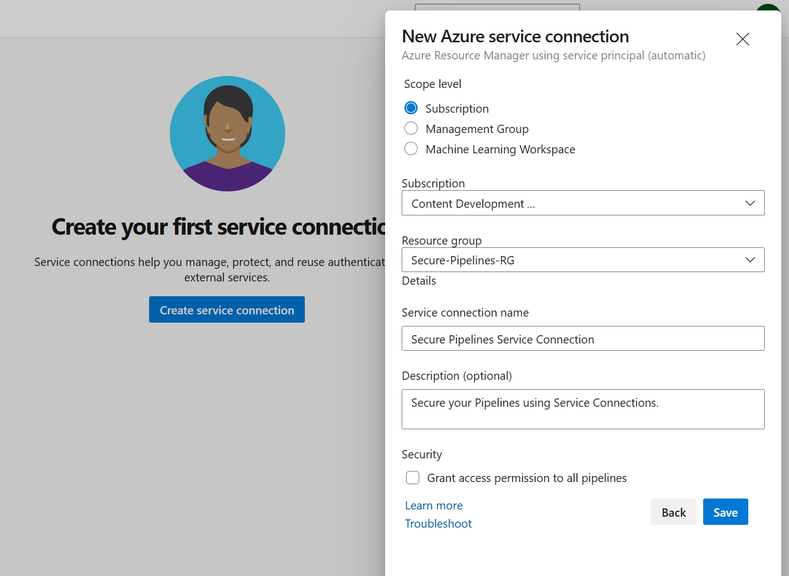

# Configure Agent pools

- It's crucial to control and manage access to your pipelines and the resources they use, such as agent pools.

- By controlling access to agent pools, you can ensure the execution of your pipeline on the right set of agents and grant the right level of permissions to the pipelines.

## Pipeline Permissions

- Pipeline permissions control which YAML pipelines are authorized to use an agent pool. Pipeline permissions don't restrict access from Classic pipelines.

- You can choose from the following options:

    - Open access for all pipelines to use the agent pool from the more options at the top-right corner of the Pipeline permissions section in the security tab of an agent pool.

    - Lock down the agent pool and only allow selected YAML pipelines to use it. If any other YAML pipeline refers to the agent pool, an authorization request gets raised, which must be approved by an agent pool Administrator. This doesn't limit access from Classic pipelines.

- Pipeline permissions for the Azure Pipelines agent pool can't be configured, as the pool is accessible, by default, to all pipelines.

- The Security action in the Agent pools tab is used to control the security of all project agent pools in a project. Role memberships for individual project agent pools are automatically inherited from what you define here. By default, the following groups are added to the Administrator role of 'All agent pools': Build Administrators, Release Administrators, Project Administrators.

## Configure Pipeline access to agent pools

- By configuring pipeline access to agent pools, you can ensure that your pipelines are executed on the right set of agents and that the right level of permissions is granted to the pipelines. You can restrict access to specific pipelines or allow all pipelines to use a specific agent pool.

1. Sign-in to your Azure DevOps organization.

2. Navigate to the project for which you want to configure pipeline access to agent pools.

3. Go to Project Settings, then click on Agent Pools under Pipelines.

4. Choose the agent pool to which you want to grant access to your pipeline.

5. Go to the Security tab.

6. Click on the + button (Add pipeline) to add a new pipeline.

7. (Optional) Search for the pipeline name.

8. Select the name of the pipeline to which you want to grant access to the current agent.

9. Your pipeline is ready to run from the agent you select.

# Use Secret Variables and Variable groups

- Security and protection of sensitive information are of utmost importance in your projects. Using Secret Variables and Variable Groups, you can ensure that sensitive information such as passwords, API keys, or other secrets are stored securely and protected from unauthorized access.

- In Azure DevOps, secret variables are stored encrypted and can only be accessed by authorized users. It protects sensitive information from being exposed or leaked in your build and release pipelines. Additionally, variable groups allow you to organize variables and manage access permissions for multiple users or teams in a centralized location.

- You can protect sensitive information throughout the DevOps phases by using secret variables and variable groups. It helps to ensure that your projects are secure, trustworthy, and meet industry standards for safety and privacy. The integrity of your projects is crucial, and you need to reduce the risk of security breaches.

## Create a Variable Group and secret variables

1. Navigate to the Azure DevOps project where you want to store your secrets.

2. Go to the Pipelines section and select Library.

3. Click on Variable Groups.

4. Click on the New Variable Group button (+ Variable group).

5. Enter a name for your Variable Group.

6. Add your secret variables to the Variable Group by clicking on the Add button.

7. (Optional) If you want to encrypt and securely store the value, choose the "lock" icon at the end of the row.

8. Click on the Save button to store your Variable Group.

## Configure permissions and access

1. Navigate to the Azure DevOps project where you want to store your secrets.

2. Go to the Pipelines section and select Library.

3. Click on Variable Groups.

4. Click on the Variable Group that you want to configure.

5. Click on the Security button.

6. Add the users or groups that you want to have access to the Variable Group.

7. Assign the appropriate permissions to each user or group.

8. Click on the Save button to store your changes.


## Configure Pipeline permissions

1. Navigate to the Azure DevOps project where you want to store your secrets.

2. Go to the Pipelines section and select Library.

3. Click on Variable Groups.

4. Click on the Variable Group that you want to configure.

5. Click on the Pipeline permissions button.

6. Add the pipeline you want to allow and have access to the Variable Group.

7. (Optional) You can Open Access to all pipelines access the resource.

# Understand secure files

- It's important to keep sensitive files such as certificates, private keys, or SSH Keys securely stored and protected from unauthorized access. Azure DevOps provides a secure file storage solution called Secure Files, which allows you to store and manage sensitive files within your projects securely.

- Using Secure Files in Azure DevOps provides several benefits for protecting sensitive files in your projects.

- Access to secure files is controlled through Azure DevOps permissions and can only be restricted to authorized users. All files are encrypted and stored securely.

- Secure Files can be easily accessed and used in the build and release pipelines, eliminating the need to store sensitive files in a separate location. Secure Files help to maintain the security and privacy of sensitive files, reducing the risk of security breaches.

## Create a secure File

1. Go to the Azure DevOps project where you want to store the secure file.

2. Navigate to the Library tab in the Pipelines section.

3. Click on Secure Files and then click on the + Secure file button.

4. Upload the file you want to store securely.

5. Click on OK


## Add the Secure File to the Pipeline

1. Go to your pipeline where you want to use the Secure File.

2. Click to edit your existing pipeline, or create a new pipeline.

3. Use the Download Secure File task to consume secure files.

```YAML

steps:
- task: DownloadSecureFile@1
  name: SecureFile
  inputs:
    secureFile: 'SecureFile.cer'
  displayName: 'Download Secure File'

- task: CopyFiles@2
  inputs:
    SourceFolder: $(Agent.TempDirectory) # or use the file directly '$(SecureFile.secureFilePath)'
    Contents: '**.cer'
    TargetFolder: '$(Build.ArtifactStagingDirectory)\secrets'
  displayName: 'Copy Secure File to Artifact Staging Directory'

```

-  The first task DownloadSecureFile@1 is used to download the secure file specified in the secureFile input. The second task CopyFiles@2 is used to copy the secure file to the artifact staging directory. The secure file will now be available for use in your build pipeline and can be passed to other tasks or stages as needed.

4. Save and Commit the YAML pipeline.

5. (Optional) Run the pipeline. If you see the message:

    - *There was a resource authorization issue: "The pipeline is not valid. Job Build: Step DownloadSecureFile input secureFile references secure file which could not be found. The secure file does not exist or has not been authorized for use."*

6. (Optional) Click on the Authorize Resources button to allow usage of the Secure File by the pipeline.

7. (Optional) Click to rerun failed jobs, or run new.

8. The pipeline downloads the secure file to the agent folder.

- *When the pipeline job completes, whether it succeeds, fails, or is canceled, the secure file is deleted from its download location.*

- Secure Files in Azure DevOps is an essential tool for storing and protecting sensitive files in your projects. Ensure your sensitive files are securely accessible to authorized users in your pipelines.

# Configure Service Connections 

- Service connections in Azure DevOps allow you to connect to external services and resources securely. These connections can access databases, third-party APIs, and cloud services. You can automate deployment, testing, and other processes using service connections without storing sensitive information in your codebase.

## Create a Service Connection

- To create a service connection, you need to be a Project Administrator or a Project Collection Administrator in Azure DevOps.

1. Navigate to the Project Settings in Azure DevOps.

2. Click on the Service Connections tab under Pipelines.

3. Click on the "Create service connection" button.

4. Select the type of service connection you want to create (for example, Azure Resource Manager, GitHub, etc.).

5. Enter the necessary information to connect to the service (for example, subscription ID, access key, etc.).

6. (Optional) Click on the "Verify connection" button to validate your connection.

7. Give your service connection a meaningful name and description.

8. Click on the "Save" button to create the service connection. 



## Configure Pipeline permissions to service connection

1. Go to the Azure DevOps project where the service connection was created.

2. Click on the Project settings located in the bottom left corner.

3. Under the Pipelines section, select Service connections.

4. Click on the service connection you want to grant access to the pipeline.

5. Click on the three dots (...) on the right side of the service connection, and select Security.

6. In the Pipeline permissions section, add the pipeline that should have access to the service connection.

7. Click on the Save button to save the pipeline permissions.

## Use the service connection in a pipeline

```yaml

steps:
- task: AzureResourceManagerTemplateDeployment@3
  displayName: 'Create Azure Resource Group'
  inputs:
    deploymentScope: 'Resource Group'
    azureResourceManagerConnection: 'Secure Pipelines Service Connection'
    subscriptionId: '<your-subscription-id>'
    action: 'Create Or Update Resource Group'
    resourceGroupName: 'Secure-Pipelines-RG'
    location: 'Central US'
    templateLocation: 'Linked artifact'
    deploymentMode: 'Incremental'

```

- Using a YAML pipeline to deploy an Azure Resource Manager (ARM) template. The pipeline contains a task AzureResourceManagerTemplateDeployment@3, used to deploy the ARM template. The task requires several inputs, such as the deploymentScope, azureResourceManagerConnection, action, resourceGroupName, location, templateLocation, etc.

- By using service connections, you can automate deployment, testing, and other processes that help maintain your projects' security and integrity and make it easier to manage and update the information as needed.

# Manage Environments

- You can use Environments to isolate different application stages, such as development, testing, and production. Azure DevOps provides an environment management feature that makes it easy to manage the environments used in your pipelines.

- Using Environments in Azure DevOps provides traceability from code to the physical deployment targets, improves resource health and visibility, and supports zero downtime deployments using deployment strategies (runOnce, canary, blueGreen, and rolling). Also, you can easily manage the deployment of the application to different stages.

## Configure Environments

- While an environment is a grouping of resources, the resources represent actual deployment targets. The Kubernetes resource and virtual machine resource types are currently supported.

1. Sign-in to your Azure DevOps organization.

2. Go to the project for which you want to configure environments.

3. Go to the Environments, under Pipelines.

4. Click on the Create environment button.

5. Give a name to the environment, such as Development.

6. Choose the environment type. (None if you want to add resources later).

7. Click on the Create button.

8. Repeat the above steps to create more environments, such as Testing and Production.


## Manage Environments and Security 

1. Go to the Environments page.

2. Select an environment, such as Development.

3. Click on the ellipsis (...).

4. Click on the Edit button to update the environment settings, such as the environment name and description.

5. Click on the Security button to update user and pipeline permissions.

6. Add the pipeline you want to allow to use and have access to the Environment.

7. Repeat the above steps to manage other environments.


## Use environments in YAML pipelines

```YAML

- stage: deploy
  jobs:
  - deployment: DeployWeb
    displayName: Deploy Web App
    pool:
      vmImage: 'Ubuntu-latest'
    environment: 'Development'
    strategy:
      runOnce:
        deploy:
          steps:
          - script: echo Hello world securing your environments!

```

- It allows you to deploy the application to different environments by changing the environment name in the env section.

# Secure Repositories

- When using Azure DevOps for pipeline automation, it's crucial to limit the access of pipelines to only the repositories they need. It helps to ensure that the pipelines are only making changes and deploying code to the correct places and minimizes the risk of unintended actions that could cause security or stability issues.

- It's essential to ensure that the pipeline has the necessary permissions to access and integrate with the repository. With the proper configuration, you can maintain the security and privacy of your code while ensuring that the pipeline can access it efficiently.

## Protect access to repositories

- Azure DevOps provides a permissions mechanism for Azure Repos in the form of the Protect access to repositories in the YAML pipelines setting. This setting makes a YAML pipeline explicitly ask permission to access all Azure Repos repositories. It's a default configuration.

- To verify or disable it for your project:

    1. Sign-in to your Azure DevOps organization.
    2. Navigate to the project for which you want to configure the pipeline protection.
    3. Go to Project Settings, then click on Settings under Pipelines.
    4. Under general, toggle the option Protect access to repositories in YAML pipelines to disable or enable it.

## Configure Pipeline access to the repository

- Once you confirm your settings, you can configure pipeline access to the repository.

    1. Navigate to the pipeline you want to configure access for.

    2. Click on the "Edit" button to open the pipeline YAML file.

    3. In the YAML file, configure the repositories you want to consume.

```yaml

resources:
  repositories:
    - repository: eShopOnWeb
      name: eShopOnWeb
      type: git
    - repository: implement-security-through-pipeline-using-devops
      name: implement-security-through-pipeline-using-devops
      type: git
    - repository: MyWebApp
      name: Contoso/MyWebApp
      type: git

```

- This step will check out the code from the specified repository and reference, and make it available for the rest of the pipeline to use. You can validate the pipeline access by observing the logs and ensuring that the code was retrieved from the repository successfully.

- When running the pipeline using more than one repository, the pipeline asks permission to access the "eShopOnWeb", MyWebApp and "implement-security-through-pipeline-using-devops" repositories.

## Authorize Specific Pipelines to access the repository

- By restricting pipeline access to specific repositories, you can ensure that only authorized pipelines have access to the codebase and its sensitive information. It helps to prevent unauthorized access to sensitive data, such as passwords, API keys, and other confidential information that (shouldn't) may be stored in the codebase.

    1. Sign-in to your Azure DevOps organization.
    2. Navigate to the project for which you want to configure pipeline access and repository.
    3. Go to Project Settings, then click on Repositories under Repos.
    4. Choose the repository to which you want to grant access to your pipeline.
    5. Go to the Security tab.
    6. Click on the + button (Add pipeline) in the Pipeline permissions section to add a new pipeline.
    7. (Optional) Search for the pipeline name.
    8. Select the name of the pipeline to which you want to grant access to the current repository.


- Additionally, restricting pipeline access to specific repositories also helps to ensure that pipelines can only make changes to the codebase through authorized means. For example, pipelines that only have access to a particular repository may not be able to push code changes directly to the repository but may be required to submit pull requests for review and approval. It helps to prevent unplanned and unintended changes to the codebase and ensures that changes are made through a controlled and secure process.