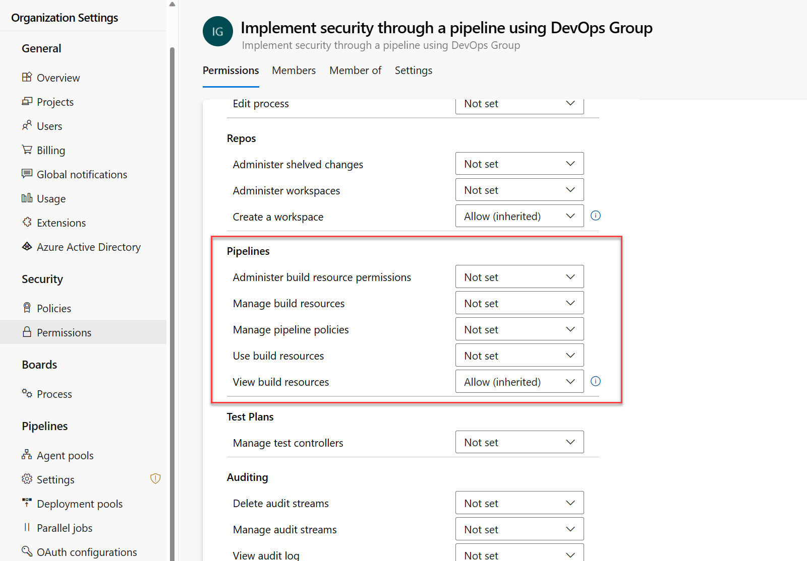

# Configure and validate user permissions

- By validating user permissions, you can check that only authorized users can access and modify your pipelines and that unauthorized users are blocked from performing actions that could compromise your code or resources. Validating user permissions can help you identify and fix security gaps or pipeline issues.

- There are many ways to configure user permissions in Azure DevOps. You can use the Azure DevOps web interface or the Azure DevOps REST API. You can also use the Azure DevOps CLI to manage user permissions.

- When you decide how to add permissions, you should consider the following factors:

    - The number of users and groups you need to add to your project.
    - The users who need temporary access to a specific resource or pipeline.
    - Whether you want to add users and groups to a specific project or the entire organization.
    - Whether you want to add users and groups to a specific pipeline, resource, approval, branch check, audit, environment, etc.
    - For every user and group you add to your project, you can specify the permissions they have for the project. Azure DevOps provides a set of predefined permissions that you can use to control access to your project. You can also create custom permissions to meet your specific needs.

- It's recommended to follow the principle of least privilege, granting users only the minimum level of access required to perform their job functions and regularly reviewing and updating permissions as needed.

## Add users or Groups to the Project

1. Open the Azure DevOps project and select the Project settings.

2. In the Project Settings menu, select the Permissions option under General.

3. You can view and manage the security groups, users, and their permissions.

4. Select the group you want to add users.

5. Select the "Members" tab to view the list of users in the group.

6. Click on the "+ Add" button, then select the user or group you want to add.

7. To specify permissions for the user, you can open the new added user and make changes to the default inherited permissions.

## Add users to specific Teams

- You can create teams or groups based on your organizational structure if you have many users and groups. Teams are a collection of users and groups with access to a specific project. You can add users to a team and then add the team to a particular pipeline. This way, you can manage permissions for many users and groups in a single place.

1. Open the Azure DevOps project and select the Project settings.

2. In the Project Settings menu, select the Teams option under General.

3. You can view and manage the teams and their permissions.

4. Select the team you want to add users.

5. Select the "Members" tab to view the list of users in the team.

6. Click on the "+ Add" button, then select the user or group you want to add.

7. To specify permissions for the user, you can open the new added user and make changes to the default inherited permissions.

## Validating User Permissions

- Use test cases to verify that users have access to the resources they need to complete their tasks.

- Perform a thorough review of your user permissions at regular intervals to ensure that they're up to date and reflect the project's current state.

- Use the Azure DevOps audit logs to monitor changes to user permissions and track any unauthorized changes.

# Configure and Validate Pipeline Permissions

- Configuring and validating permissions in Azure Pipelines is crucial to ensure that only authorized users can access the pipelines, environments, and other resources. Failure to properly manage and validate user permissions can result in serious security issues and potentially put your organization at risk.

- If unauthorized users have access to your pipelines, they can make changes to your code, steal your secrets, and even access your production environment.

## Set Organizational level pipeline permissions

- Organization-level pipeline permissions control who can create, edit, delete, or view pipelines across all projects in your organization. You can set these permissions for Azure DevOps groups or individual users.

1. Sign in to your organization.

2. Click on Organization Settings at the bottom left and in Permissions under the Security section.

3. Select a group or user from the list, or use the search box to find one.

4. Select Permissions and then find Pipelines.

5. Modify the permissions as needed, such as allowing or denying manage pipeline policies, view build resources, etc.

## Set Project level Pipeline Permissions

- Project-level pipeline permissions apply to all pipelines in your project. You can grant or deny access to specific Azure DevOps groups or individual users.

- To set project-level pipeline permissions:

1. Sign in to your Azure DevOps organization.

2. From your project, select Pipelines under Pipelines.

3. Select the three dots in the top right corner (...), and click Manage security.

4. Modify the group or user permissions as you need.

5. Select Allow or Deny the permission for a security group or an individual user, and then exit the screen.

6. Some common permissions are:

    - Edit build pipeline: Allows editing existing pipelines.
    - View build pipeline: Allows viewing existing pipelines and their runs.
    - Queue builds: Allows queuing new runs for existing pipelines.

## Select Folder Level Pipeline Permissions

1. Open your Azure DevOps project and select Pipelines under Pipelines.

2. Select a folder from the list of folders, or create a new one by selecting New folder.

3. Select the three dots in the top right corner (...), and click Manage security for the folder you want to modify.

4. Modify the permissions associated with an Azure DevOps group or an individual user.

# Configure and Validate Approval branch Checks

- In Azure DevOps, you can configure and validate approvals and branch checks to ensure that changes to your code are reviewed and approved before being deployed to production. It helps to prevent errors and vulnerabilities in your code from reaching production and causing issues.

- Approval and branch checks are critical components of a secure software development process. By requiring approvals for code changes and validating branch names and versions, you can prevent unauthorized changes from being deployed to production.

## Set up approvals and checks

1. In your Azure DevOps project, click on Environments under Pipelines.

2. Select the environment for which you want to create the approval or branch check. If you don't have an environment, you can create one by clicking on the "New environment" button.

3. Click on the three dots "..." button next to the Add resource button and select "Approvals and Checks" from the dropdown menu.

4. To add an approval check, select the "Approvals".

5. In the "Add Approvals" dialog box, you can configure the details of the approval check, such as the approvers, the instructions to approvers, if the approver can approve their own runs, and the approval timeout.

6. Click on the Create button to create the approval check.

7. Back to "Approvals and Checks" to add a branch check, select the "Branch control".

8. In the "Branch control" dialog box, you can configure the details of the branch check, such as the allowed branches, a check to verify branch protection, and the timeout.

9. Click on the "Create" button to save your changes.

- There are other types of checks that you can add to your environment. It's important to understand the purpose of each check and how it can help you to secure your software development process.

- For example: Business Hours, Evaluate artifact, Exclusive Lock, Invoke Azure Function, Invoke REST API, Query Azure Monitor alerts, Required template, ServiceNow Change Management, etc.

# Manage and Audit Permissions

- Managing permissions is essential to maintaining security and control over your pipelines and resources. By setting permissions, you can restrict access to sensitive data and ensure that only authorized users can access certain features.

## Manage Organization Permissions

- You can also set permissions for specific projects. The steps and configuration are similar to the organization-level permissions.

- To configure permissions for an organization:

    1. Sign in to your Azure DevOps organization.
    2. Click on Organization Settings at the bottom left and in Permissions under the Security section.
    3. Under "Permissions," select the group or user you want to manage permissions for.
    4. Click on "Permissions," and select the type of permissions you want to set (for example, "General," "Repos," "Pipelines," "Auditing," etc.).
    5. Choose the level of permission you want to assign (for example, "Allow," "Deny," or "Not set").

## Audit Permissions 

- Audit logs provide a record of every operation that occurs in Azure DevOps, including all changes made to work items, builds, releases, and pipelines.

- By reviewing audit logs, administrators and security professionals can identify unauthorized access attempts, suspicious activity, or compliance violations. This information can help prevent security breaches and ensure compliance with regulations and organizational policies.

- In addition, audit logs can help teams identify issues and improve their processes by providing detailed information about what actions were taken and by whom. By regularly reviewing audit logs, teams can identify potential problems and take corrective measures to prevent them.

- To configure auditing for your organization:

    1. Sign in to your Azure DevOps organization.

    2. Click on Organization Settings at the bottom left and in Policies under the Security section.

    3. Under Security policies, enable Log Audit Events.

    4. The Auditing section appears in the left navigation pane under General. Click on it.

    5. The audit log provides a simple view into the audit events recorded for your organization.

    6. You can filter the audit log by user, date range, or permission type to get a more specific view of the changes.

    7. (Optional) You can export the audit log to a CSV or JSON file by clicking on the Export button, or you can view the details of a specific event by clicking on the event

