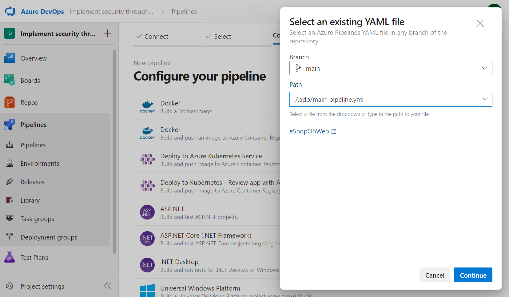

# Extend a pipeline to use multiple templates

## Introduction

- Separating YAML pipeline files in multiple repositories, projects, or templates is essential to help improve Azure DevOps security.

- Implementing nested templates and tokens, and sensitive information such as credentials, secrets, and other configuration settings, helps abstract the main deployment pipeline and store it in a more secure location. This approach helps to limit the exposure of sensitive information to unauthorized users, reduce the risk of data breaches and prevent unauthorized access to critical resources.

- In addition, by separating the pipeline configuration into smaller, more manageable pieces, it's easier to manage changes and version control, which can help to prevent errors and conflicts that can lead to security issues. By applying the power of nested templates, it's also possible to reduce duplication in the pipeline configuration, which can help simplify the pipeline's maintenance and management over time.

# Create a nested template 

- A nested template is a reusable YAML file that contains a set of tasks that can be called from another YAML file. This approach can simplify the pipeline's maintenance and management over time and reduce the amount of duplication in the pipeline configuration.

## YAML templates and security benefits

- Using templates in YAML pipelines can provide several security advantages, such as:

    - Improved secret management: Nested templates can help you abstract sensitive information such as credentials, secrets, and other configuration settings from the main deployment pipeline, making managing and securing these sensitive items easier. These can be stored in a more secure location or Azure Key Vault, reducing the exposure of sensitive information to unauthorized users and preventing unauthorized access to critical resources.
    - Reduced risk of data breaches: By abstracting sensitive information from the main deployment pipeline, you reduce the risk of data breaches that can occur when sensitive information is exposed to unauthorized users or stored in an insecure location.
    - Easier permissions management and access: With nested templates, you can better manage access control to the templates and configuration files, giving you granular control over who can access and modify specific pipeline components.
    - Better pipeline version control: Separating pipeline configuration into smaller, more manageable pieces makes it easier to manage changes and version control, which can help prevent errors and conflicts that can lead to security issues.
    - Simplified pipeline maintenance: By applying the power of nested templates, it's possible to reduce duplication in the pipeline configuration, which can help simplify the pipeline's maintenance and management over time.

## Create a YAML file for the nested template

- Create a YAML file in your Git repository called secure-template.yaml. This file contains the pipeline's tasks that you want to reuse in other YAML files.

```YAML

parameters:
  message: ''

steps:
- task: PowerShell@2
  inputs:
    targetType: Inline
    script: |
      Write-Host "${{ parameters.message }}"
      Write-Host "$(Secure)"

```

## Create a YAML file for the main pipeline

- Create a YAML file called `main-pipeline.yaml` for the pipeline that calls the nested template. You can use the template property to call the nested template.

```yaml

name: 'Pipeline templates'
stages:
- stage: Build
  displayName: 'Securing pipelines with templates'
  jobs:
  - job: Build
    pool:
      vmImage: windows-latest
    variables:
    - name: Secure
      value: 'Secret!'
    steps:
    - template: '../.secure/secure-template.yaml'
      parameters:
        message: 'This is from the main template!'

```

## Create a New Pipeline 

- Navigate to your Azure DevOps project and create a new pipeline. Select the repository and branch where you committed the changes. Select the YAML file for the main pipeline (main-pipeline.yaml in our example) and run the pipeline.



- Verify that the nested template is called and the values of the parameters are printed.

# Rewrite the main deployment pipeline

- Azure Pipelines allows you to define build and release processes using YAML templates. Templates are reusable and enable you to define your pipelines declaratively. It means you can define your pipelines as code, commit the code to your source control repository, and have it versioned and managed like any other code.

## Template types and usages

- Azure Pipelines supports four types of templates:

    - Stage template - You can use a stage template to define a stage you want to reuse in multiple pipelines. For example, you can specify a stage template that deploys an application to a specific environment. You can reuse the stage template in multiple pipelines to deploy the application to different environments.

    - Job template - You can define a job template that builds a specific application. You can reuse the job template in multiple pipelines to build the application for different platforms.

    - Step template - You can define a step template that creates a resource group. You can reuse the step template in multiple pipelines to create a resource group for different applications.

    - Variable template - You can define a variable template that establishes a connection string to a database. You can reuse the variable template in multiple pipelines to connect to the database.

## Stage Template 

- You can define a set of stages in one file and use it multiple times in other files.

```yaml

# File: stages/test.yaml

parameters:
  name: ''
  testFile: ''

stages:

- stage: Test_${{ parameters.name }}
  jobs:

  - job: ${{ parameters.name }}_Windows
    pool:
      vmImage: windows-latest
    steps:

    - script: npm install
    - script: npm test -- --file=${{ parameters.testFile }}

  - job: ${{ parameters.name }}_Mac
    pool:
      vmImage: macOS-latest
    steps:

    - script: npm install
    - script: npm test -- --file=${{ parameters.testFile }}

```

- Templated Pipeline

```yaml

# File: stages/test.yaml

stages:

- template: stages/test.yaml # Template reference
  parameters:
    name: Mini
    testFile: tests/miniSuite.js

- template: stages/test.yaml
  parameters:
    name: Full
    testFile: tests/fullSuite.js

```

## Job Templates

- You can define a set of jobs in one file and use it multiple times in others.

```yaml

# File: jobs/build.yaml

parameters:
  name: ''
  pool: ''
  sign: false

jobs:

- job: ${{ parameters.name }}
  pool: ${{ parameters.pool }}
  steps:

  - script: npm install
  - script: npm test

  - ${{ if eq(parameters.sign, 'true') }}:
    - script: sign

```

- Templated Pipeline

```yaml

# File: azure-pipelines.yaml

jobs:

- template: jobs/build.yaml  # Template reference
  parameters:
    name: macOS
    pool:
      vmImage: 'macOS-latest'


- template: jobs/build.yaml  # Template reference
  parameters:
    name: Linux
    pool:
      vmImage: 'ubuntu-latest'


- template: jobs/build.yaml  # Template reference
  parameters:
    name: Windows
    pool:
      vmImage: 'windows-latest'
    sign: true  # Extra step on Windows only

```

## Step Templates

```yaml

# File: steps/build.yaml

steps:

- script: npm install
- script: npm test

```

- Templated Pipeline

```yaml

# File: azure-pipelines.yaml

jobs:

- job: macOS
  pool:
    vmImage: 'macOS-latest'
  steps:

  - template: steps/build.yaml # Template reference


- job: Linux
  pool:
    vmImage: 'ubuntu-latest'
  steps:

  - template: steps/build.yaml # Template reference


- job: Windows
  pool:
    vmImage: 'windows-latest'
  steps:

  - template: steps/build.yaml # Template reference
  - script: sign              # Extra step on Windows only

```

## Variable Templates

```yaml

# File: variables/build.yaml
variables:

- name: vmImage
  value: windows-latest

- name: arch
  value: x64

- name: config
  value: debug

```

- Templated Pipelines

```yaml

# File: component-x-pipeline.yaml
variables:

- template: variables/build.yaml  # Template reference
pool:
  vmImage: ${{ variables.vmImage }}
steps:

- script: build x ${{ variables.arch }} ${{ variables.config }}

```


```yaml

# File: component-y-pipeline.yaml
variables:

- template: variables/build.yaml  # Template reference
pool:
  vmImage: ${{ variables.vmImage }}
steps:

- script: build y ${{ variables.arch }} ${{ variables.config }}

```

# Configure the Pipeline and the application to use Tokenization

- Azure Key Vault is a secure secret, key, and certificate store. Azure Key Vault can ensure that your tokens and secrets are stored securely and easily accessed by your pipeline without exposing them in plain text. Azure Pipelines provides built-in tasks that enable you to retrieve secrets from Azure Key Vault during pipeline execution.

## Reference Azure Key Vault in a variable group

- One way to use Azure Key Vault with YAML pipeline templates is to create a variable group that references the Key Vault. Here are the steps:

    1. In Azure DevOps, click on Library under Pipelines.
    2. Create a new variable group or use existing groups.
    3. Give the variable group a name and description.
    4. Under Variables, add a new variable and set its value to $(keyVaultSecret). Use this variable to retrieve the secret from Azure Key Vault.
    5. Under Link secrets, link the variable group to your Azure Key Vault and grant read access to the service principal that will be used to access the Key Vault.
    6. Save the variable group.

```yaml

variables:
- group: <variable group name>

steps:
- task: AzureKeyVault@2
  inputs:
    azureSubscription: '<Azure subscription service connection>'
    KeyVaultName: '<Key Vault name>'
    SecretsFilter: '*'
    RunAsPreJob: true

```

## Pass Azure Key Vault as a Parameter

- Another way to use Azure Key Vault with YAML pipeline templates is to pass the secret as a parameter to the template.

1. In Azure DevOps, create a new pipeline and choose YAML.

2. In the pipeline, define a parameter for the secret:

```yaml

parameters:
  - name: keyVaultSecret
    type: string

```

3. In the pipeline, use the AzureKeyVault task to retrieve the secret:

```yaml

steps:
- task: AzureKeyVault@2
  inputs:
    azureSubscription: '<Azure subscription service connection>'
    KeyVaultName: '<Key Vault name>'
    SecretsFilter: '$(keyVaultSecret)'

```

4. In the pipeline, pass the secret as a parameter to the template:

```yaml

- template: template.yaml
  parameters:
    keyVaultSecret: $(keyVaultSecret)  # Replace <Azure subscription service connection> and <Key Vault name> with your own values.

```

## Use Azure Key Vault with Variables and tokens

- A third way to use Azure Key Vault with YAML pipeline templates is to combine variables, tokens, and Azure Key Vault.

1. Set the value of the variable to $(keyVaultSecret) and mark it as a secret. Use variable to retrieve the secret from Azure Key Vault.

2. In your YAML pipeline template, use the $(keyVaultSecret) variable to retrieve the secret from Azure Key Vault:

```yaml

steps:
- task: AzureKeyVault@2
  inputs:
    azureSubscription: '<Azure subscription service connection>'
    KeyVaultName: '<Key Vault name>'
    SecretsFilter: '$(keyVaultSecret)'

```

3. To tokenize the value of the secret, use the $(keyVaultSecret) variable in your pipeline:

```yaml

steps:
- script: |
    echo $(keyVaultSecret)

```

4. If you want to use the secret as an environment variable in your pipeline, you can set the environment variable in a script step:

```yaml

steps:
- task: AzureKeyVault@2
  inputs:
    azureSubscription: '<Azure subscription service connection>'
    KeyVaultName: '<Key Vault name>'
    SecretsFilter: '$(keyVaultSecret)'
- script: |
    export MY_SECRET=$(keyVaultSecret)

```

## Best practices for using Azure Key Vault with YAML pipelines

    1. Use a separate Key Vault for each environment. For example, use one Key Vault for production secrets and another for development secrets.

    2. Assign minimum required permissions to the service principal that accesses the Key Vault.

    3. Use the latest version of the AzureKeyVault task in your pipeline.

    4. Ensure Azure Key Vault soft delete is enabled to protect against accidental deletion of secrets and keys.

# Remove Plain texts secrets

- Disclosing sensitive information like passwords, API keys, or database connection strings can lead to serious security risks, such as data breaches, unauthorized access to systems, or even financial losses. It's essential to ensure plain text secrets aren't stored or transmitted insecurely.

- Removing plain text secrets and replacing them with variables or tokens is a best practice that allows teams to securely store and manage their sensitive information while still being able to use it in their pipelines or applications.

- By using secure methods like FileTransform, Azure Key Vault, or other tools, teams can ensure pipelines and applications are built and deployed securely and reliably while keeping their sensitive information safe from prying eyes.

- There are many ways to create a secure application using Azure Pipelines for each technology and type of application you're building.

# Restrict Agent Logging

- When building and deploying applications with Azure Pipelines, it's crucial to ensure pipeline agents don't inadvertently log sensitive information like passwords, API keys, or other secrets. It can happen if sensitive information is printed to the console during the build or deployment process, leading to serious security risks.

## Log Of Secrets

- Azure Pipelines attempts to scrub secrets from logs wherever possible. This filtering is on a best-effort basis and can't catch every way in which secrets can be leaked. Avoid echoing secrets to the console, using them in command line parameters, or logging them to files.

## Use the audit service

- Many pipeline events are recorded in the Auditing service. Review the audit log periodically to ensure no malicious changes have slipped past. Visit https://dev.azure.com/ORG-NAME/_settings/audit to get started.

## Ways to restrict agent logging of secrets

- When working with Azure Pipelines, it's common to use service connections, which add a new layer of security for sensitive information such as usernames, passwords, and API keys. Without service connections or other best practices, pipelines are left unsecured and their information can be easily accessed and exposed in pipeline logs, leading to potential data breaches and security risks.

- By following these suggestions and the ones we covered in other units, you can ensure that your sensitive information is kept safe and your pipeline remains a trusted and reliable tool for your organization.

    - Use Azure Key Vault: You can store sensitive information, such as passwords and API keys, separately from your pipeline in Azure Key Vault. You can reference these secrets in your pipeline without revealing them in the pipeline logs. To use Azure Key Vault, you can create a new Azure Key Vault instance, add your secrets to the vault, and then reference them in your pipeline using the Azure Key Vault task.
    - Use Variable Groups: Variable Groups are a convenient way to store and manage variables used across multiple pipelines. You can create a new variable group, add sensitive information as variables, and then reference them in your pipeline. By marking these variables as "secret," you can ensure they aren't displayed in the pipeline logs.
    - Use Environment Variables: You can also use environment variables to store your sensitive information. Environment variables are a way to store data that can be accessed by processes running on the same machine. In Azure Pipelines, you can define pipeline, job, or task environment variables. By marking these variables as "secret," you can ensure they aren't displayed in the pipeline logs.

- Regardless of your chosen method, it's crucial to ensure that your sensitive information isn't easily accessible in your pipeline logs.

## Use Agent-level logging restrictions

- Another way to restrict agent logging of secrets is to use agent-level logging restrictions. These restrictions can prevent specific commands or log levels from being printed to the console, which can further reduce the risk of exposing sensitive information.

- To use agent-level logging restrictions, follow these steps:

    1. Edit your pipeline.
    2. Select Variables.
    3. Add a new variable with the name System.Debug and value true.
    4. Save the new variable.
    5. Run your pipeline to see the logs.


## Use the issecret parameter

- The issecret parameter allows you to mask secrets in the agent logs.

- To set a variable as a script with a logging command, you need to pass the issecret flag.

- When issecret is set to true, the value of the variable will be saved as secret and masked out from log.

```yaml
- powershell: |
    Write-Host "##vso[task.setvariable variable=mySecretVal;issecret=true]secretvalue"
```

- Get the secret variable mysecretVal

```yaml
- powershell: |
    Write-Host "##vso[task.setvariable variable=mySecretVal;issecret=true]secretvalue"
- powershell: |
    Write-Host $(mySecretVal)
```

# Identify and conditionally remove scripts tasks 

- Azure Pipelines allow the execution of custom scripts during pipeline run-through script tasks. However, certain conditions may require the removal of script tasks, such as the pipeline stage or the branch being built. It can streamline pipeline execution and reduce unnecessary overhead.

- Script tasks in pipelines pose a security risk by allowing the execution of arbitrary code on the agent machine, potentially leading to sensitive information exposure and malicious code execution. Minimizing the risk of exposing sensitive information involves identifying and conditionally removing script tasks, for example, removing a script task altogether or replacing it with a more secure alternative when it includes a command that prints a password or a secret key.

- Setting up conditions for script tasks can further reduce the risk of exposing sensitive information. For instance, removing a script task that is unnecessary for a specific pipeline stage can limit the attack surface for potential attackers and decrease the likelihood of a security breach.

## Identify the scripts tasks to be removed

- To start, you need to identify the script tasks that require removal based on specific conditions. You can accomplish this by utilizing expressions in the YAML pipeline.

```yaml
jobs:
- job: Build
  steps:
  - script: |
      echo "This script task should only run during the Build stage"
    condition: eq(variables['System.StageName'], 'Build')
  - script: |
      echo "This script task should run during all stages"
```

- It allows you to remove the first script task from the pipeline without removing the second script task. It also allows you to reuse the second script task in other pipeline stages. It's helpful to run the same script task in multiple stages. For example, you may want to run a script task to build a project in the "Build" stage and then run the same script task to deploy the project in the "Deploy" stage.

## use the condition property 

- To conditionally remove a script task, utilize the "condition" property in the YAML pipeline. This property empowers you to define an expression that determines whether the script task should execute.

```yaml
jobs:
- job: Build
  steps:
  - script: |
      echo "This script task will only run if MY_VARIABLE is set"
    condition: ne(variables['MY_VARIABLE'], '')
```